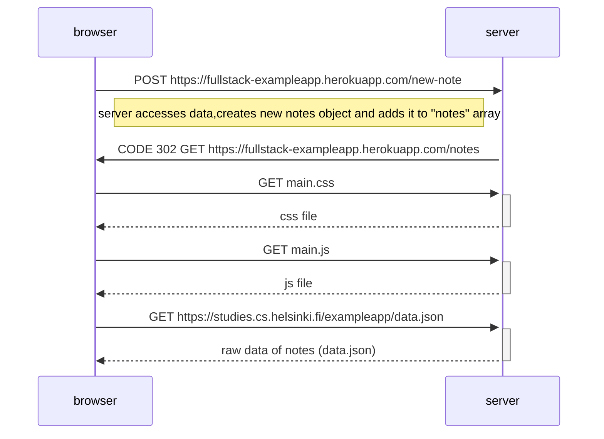

```mermaid
sequenceDiagram
    participant browser
    participant server

    browser->>server: POST https://fullstack-exampleapp.herokuapp.com/new-note
    activate server
    Note left of server:server accesses data,creates new notes object and adds it to "notes" array
    server->>browser:CODE 302 GET https://fullstack-exampleapp.herokuapp.com/notes

    browser->>server: GET main.css
    activate server
    server-->>browser: css file
    deactivate server

    browser->>server: GET main.js
    activate server
    server-->>browser: js file
    deactivate server


    browser->>server: GET https://studies.cs.helsinki.fi/exampleapp/data.json
    activate server
    server-->>browser: raw data of notes (data.json)
    deactivate server

    
```